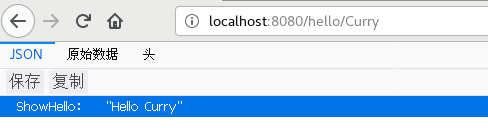
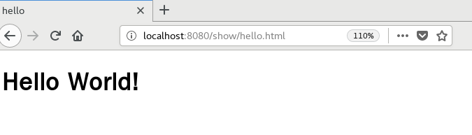
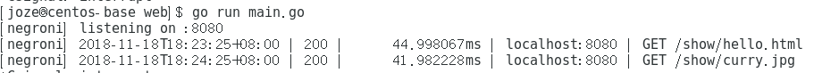
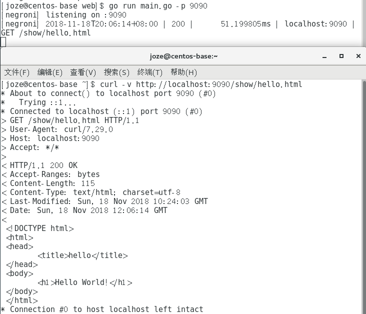
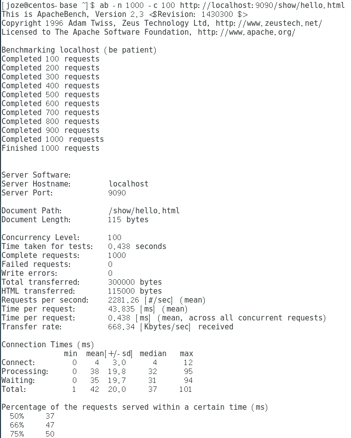
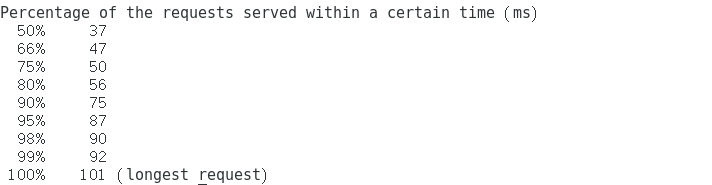

# 简单的 web 服务程序 cloudgo

## 概述

使用了 `negroni`, `mux`, `render`库，可以通过命令行参数 -p 指定监听的端口号，能够处理 `/hello/{id}` 和 `/show/{filename}` 两种请求参数

## 处理 `/hello/{id}`

Response: `ShowHello: "Hello {id}"`

## 处理 `/show/{filename}`

Response: `filename` 指定的服务器中的文件，可以是 html 或 jpg等

服务器端 log 消息

## 使用 curl 工具访问 web 程序

## 对 web 程序执行压力测试（ab 测试）

命令参数：
 - -n 执行的请求数量
 - -c 并发请求个数

**重要参数解释**
 - Server Hostname: 服务器主机名
 - Server Port: 服务器端口
 - Document Path: 文件路径
 - Document Length: 文件大小
 - Concurrency Level: 并发等级
 - Time taken for tests: 整个 ab 测试消耗的总时间
 - Complete requests: 完成的请求数
 - Failed request: 失败的请求数
 - Write errors: 写入错误数
 - Total transferred: 传输的数据的字节数
 - HTML transferred: 传输的 HTML 文件的字节数
 - Requst per second: 平均每秒的请求个数
 - Time per request: 用户平均请求等待时间
 - Time per request(across all concurrent requests): Time per request / Concurrency Level
 - Transfer rate: 传输的平均速率
 - Connection Times: 表内描述了所有的过程中所消耗的最小、平均、中位、最长时间
 - Percentage of the requests served within a certain time: 每个百分段的请求完成所需的时间